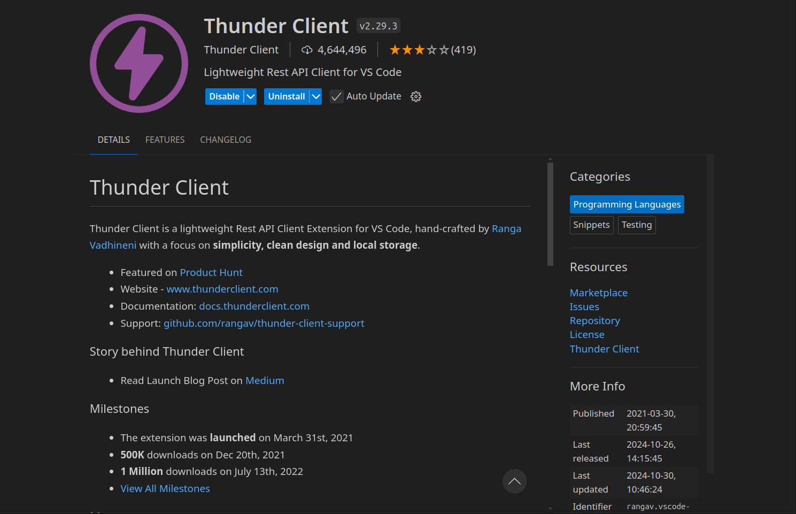

# 软件工程后端

## 环境准备

### 安装 python 虚拟环境

> 可以用 `conda` 或者其他虚拟环境，这个推荐使用 `uv`

```bash
powershell -ExecutionPolicy ByPass -c "irm https://astral.sh/uv/install.ps1 | iex"
```

安装后使用 `uv venv` 创建虚拟环境，可以按照对应的提示进入虚拟环境

```bash
uv pip install -r requirements.txt
```

安装所需要的依赖

### 安装 Docker

> 这里推荐使用 wsl2 搭配 docker 使用

这里推荐使用 [wsl2-distro-manager](https://github.com/bostrot/wsl2-distro-manager) 来安装 `wsl2`

安装 Docker 参考 Docker 的安装文档 [for-debian](https://docs.docker.com/engine/install/debian/)

## 文件介绍

```text
.
├── README.md
├── app.py
├── config.py
├── doc
│   └── API.md
├── models.py
├── requirements.txt
├── routes
│   └── user.py
└── sql
    ├── CREATE_TABLE.sql
    └── INSERT_DATA.sql
```

- `README.md`: 项目说明文件
- `app.py`: 主应用程序文件
- `config.py`: 配置文件
- `doc/API.md`: API 文档
- `models.py`: 数据模型定义
- `requirements.txt`: 项目依赖列表
- `routes/user.py`: 用户路由定义
- `sql/CREATE_TABLE.sql`: 数据库表创建脚本
- `sql/INSERT_DATA.sql`: 数据库数据插入脚本

## 开发应知应会

### 基本开发

所有添加的依赖需要添加到 requirements.txt

```requirements
flask
python-dotenv
Flask-SQLAlchemy
```

项目所有需要用到的环境变量写在 .env 中

```env
DATABASE_URL=sqlite:///data.db
```

通过 config.py 来读取配置相关的信息

```python
import os
from dotenv import load_dotenv

load_dotenv()

class Config:
    SQLALCHEMY_DATABASE_URI = os.getenv('DATABASE_URL')
    SQLALCHEMY_TRACK_MODIFICATIONS = False
```

### 数据库

数据库相关的操作通过 Flask-SQLAlchemy 来进行

```python
from flask_sqlalchemy import SQLAlchemy

db = SQLAlchemy()

class User(db.Model):
    id = db.Column(db.Integer, primary_key=True)
    username = db.Column(db.String(80), unique=True, nullable=False)
    email = db.Column(db.String(120), unique=True, nullable=False)

    def __repr__(self):
        return f'<User {self.username}>'
```

定义 python 的数据模型

创建表、约束条件和索引的操作写在 CREATE_TABLE.sql 中
插入数据的操作写在 INSERT_DATA.sql 中


### 测试 API



### 基本 git 操作

更改代码前，执行 `git pull` 获取最新的代码
更改完成后，执行 `git add --all` 添加所有更改的文件
再执行 `git commit -m "更改信息"` 更改信息用翻译器为英文，要体现更改的东西
可以多次 commit，一次 push
commit 结束后，使用 `git push` 将本地的代码同步到 github 上
如果 `git push` 的操作出现问题，按照提示 `git pull` 处理好冲突后，重新 `git push`